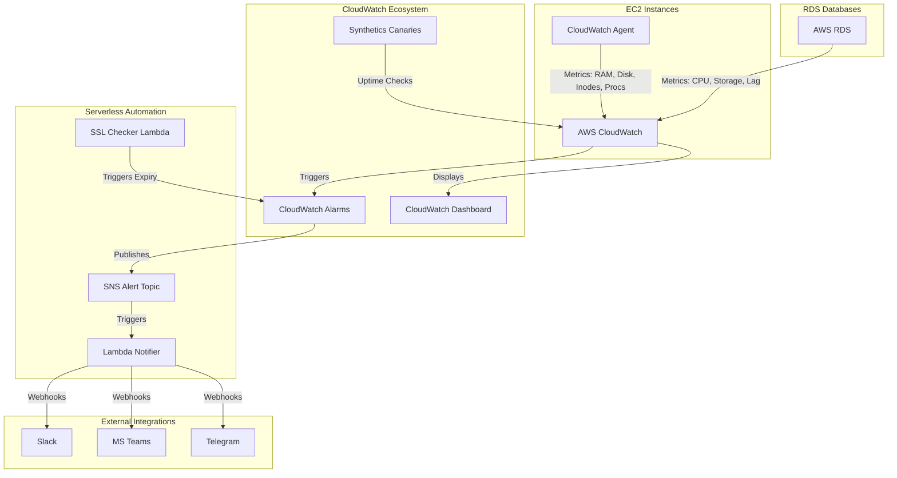

# AWS Infrastructure Monitoring Automation 🚀


A robust, zero-touch Python automation script designed to automatically configure a complete, production-grade monitoring stack in AWS. It seamlessly integrates Amazon EC2, RDS, CloudWatch, Systems Manager (SSM), Lambda, and EventBridge to provide deep visibility into your infrastructure.

---

## 🏗 Architecture Overview



---

## ✨ Features

- **Automated CloudWatch Agent Deployment:** Automatically discovers running EC2 instances, attaches the necessary IAM SSM roles, and silently installs the CloudWatch Agent.
- **Dynamic Alarm Generation:** Automatically creates high-fidelity CloudWatch Alarms for CPU, Memory, Disk Space, Free Inodes, Network Traffic, and Instance Status Checks.
- **Intelligent Process Detection:** Scans instances to detect running web servers (`nginx`, `apache`, `iis`) and databases (`mysql`, `postgres`, `mongodb`, `redis`), auto-configuring process-level monitoring (`procstat`).
- **RDS & Database Monitoring:** Configures alarms for RDS CPU, Free Storage Space, Connections, and Replication Lag.
- **SSL Certificate Monitoring:** Deploys a daily Lambda job to check external domain SSL certificates, alerting you via SNS before they expire.
- **Application Health Canaries:** Deploys AWS CloudWatch Synthetics (Puppeteer) to constantly monitor the uptime of your critical web applications.
- **Centralized Alerting Pipeline:** Routes all alerts to a central SNS topic, seamlessly forwarding them to Slack, Teams, or Telegram.

---

## 💰 AWS Cost Implications (IMPORTANT)

This script automates the creation of AWS resources that **will incur charges** on your AWS bill. Below is an estimated breakdown of costs associated with the resources created by this script (based on standard `us-east-1` pricing, subject to change):

| Service | Cost Metric | Estimated Price | Notes |
|---------|-------------|-----------------|-------|
| **CloudWatch Custom Metrics** | Per Metric / Month | `$0.30` | The CWAgent pushes custom metrics (Memory, Swap, Disk, Inodes, Process stats). Each instance pushes ~5-10 custom metrics. |
| **CloudWatch Alarms** | Per Alarm / Month | `$0.10` | The script creates ~6-8 alarms per EC2 instance and ~3-4 per RDS database. |
| **CloudWatch Dashboards** | Per Dashboard / Month | `$3.00` | Created automatically to visualize all metrics. |
| **CloudWatch Synthetics** | Per Canary Run | `$0.0012` | **High Cost Warning:** A canary running every 5 minutes costs **~$10.36 / month per URL**. If you monitor 5 URLs, that is ~$50/month. |
| **AWS Lambda** | Per Invocation | `~$0.00` | The SSL checker and webhook notifier are highly efficient and usually easily fall within the AWS Free Tier (1M requests/month). |
| **SNS (Email/HTTP)** | Per 1M Notifications | `$2.00` | First 1M SMS/Email/HTTP pushes are generally covered by Free Tier. |
| **Systems Manager (SSM)** | Core usage | `Free` | Session Manager, Run Command, and standard Parameter Store usage are free. |

*Tip: If you want to reduce costs, you can comment out the `configure_application_monitoring()` function in the script to disable Synthetics Canaries, which are the most expensive component.*

---

## 🚀 Usage

For the safest and most reliable execution, we recommend running this script directly from **AWS CloudShell**, which comes pre-authenticated and pre-installed with Python 3 and `boto3`.

### 1. Launch AWS CloudShell
Log in to your AWS Management Console and open **CloudShell** (the terminal icon at the top right).

### 2. Upload the Script
Upload `aws_monitoring_setup.py` into your CloudShell environment.

### 3. Execute
Run the script using Python 3:

```bash
# Run with interactive step-by-step approvals (Recommended for first run)
python3 aws_monitoring_setup.py

# Run with auto-approval and automatically clean up any old monitoring alarms
python3 aws_monitoring_setup.py --auto-approve --clean-alarms
```

---

## 🔒 Security & Architecture

This script strictly adheres to the principle of least privilege:
- Dynamically creates IAM Roles and Instance Profiles specifically for monitoring.
- Uses **AWS Systems Manager (SSM)** instead of SSH—meaning you do not need to open inbound port 22 or manage SSH keys to deploy the CloudWatch Agent.
- Webhook tokens and secrets are stored securely in AWS Systems Manager Parameter Store as `SecureString` types.

---

## 📄 License

This project is licensed under the MIT License. See the [LICENSE](LICENSE) file for details.
